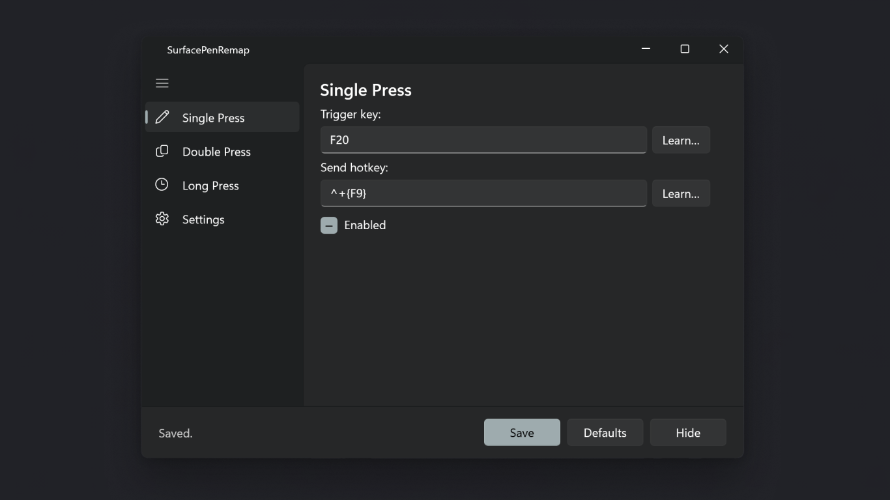

# SlimPen Hotkeys

Remap your Surface Slim Pen top-button gestures (single press, double press,
long press) to any keyboard shortcut.

## Features

- Map all three pen button gestures to independent hotkeys
- Fires on trigger release to prevent phantom modifier leaks
- Learn buttons for easy hotkey capture
- Individual enable/disable per gesture, plus a master toggle
- System tray icon with quick-access menu
- Minimal, modern WinUI 3 interface with Mica backdrop

## Download

Install from the [Microsoft Store](https://apps.microsoft.com/search?query=SlimPen+Hotkeys&publisher=130public) or build from [source on GitHub](https://github.com/130public/SlimPenHotkeys).

## Prerequisites

Before using this tool, go to **Settings → Bluetooth & devices → Pen &
Windows Ink** and set the pen button shortcuts to **Nothing**. This ensures
Windows sends the raw key events (F18/F19/F20) that SlimPen Hotkeys intercepts.

## Support

File issues on [GitHub](https://github.com/130public/SlimPenHotkeys/issues).

---

## Privacy Policy

**Effective date:** July 10, 2026

SlimPen Hotkeys ("the App") is published by 130public.

### Data Collection

The App does **not** collect, store, transmit, or share any personal data.
It does not use analytics, telemetry, advertising SDKs, or any network
connections whatsoever.

### Keyboard Input

The App installs a global low-level keyboard hook solely to detect the
Surface Pen's button key events (F18, F19, F20). It remaps these to a
user-configured keyboard shortcut via `SendInput`. **No keystrokes are
logged, recorded, stored, or transmitted.** The hook only inspects the
specific trigger keys configured by the user; all other keys are passed
through unmodified.

### Local Storage

User preferences (trigger keys, hotkey assignments, enabled state) are
stored locally on-device in a settings file. No data ever leaves the device.

### Third-Party Services

The App uses no third-party services, APIs, or cloud infrastructure.

### Children's Privacy

The App does not knowingly collect any information from children under 13.

### Changes to This Policy

If this policy is updated, the revised version will be posted at this URL.

### Contact

For questions about this privacy policy, open an issue on
[GitHub](https://github.com/130public/SlimPenHotkeys/issues).
